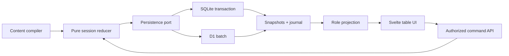

# Campaigns and Shared Tarot Delivery Roadmap Implementation Plan

> **For agentic workers:** REQUIRED SUB-SKILL: Use superpowers:subagent-driven-development (recommended) or superpowers:executing-plans to implement this plan task-by-task. Steps use checkbox (`- [ ]`) syntax for tracking.

**Goal:** Deliver the approved, table-first campaign feature as a sequence of independently verifiable increments, ending with a guarded production rollout.

**Architecture:** A SvelteKit monolith exposes campaign services and role-projected APIs over a pure shared-tarot reducer. SQLite transactions and D1 batches persist versioned public/private/server snapshots plus an append-only command/event journal. The browser sends intent and never owns authoritative shuffles, hidden card identities, or rule results.

**Tech Stack:** SvelteKit 2, Svelte 5 runes, TypeScript strict, Drizzle ORM, SQLite/better-sqlite3, Cloudflare D1, Zod, Vitest, Playwright, Tailwind CSS v4.

## Global Constraints

- The approved specification at `docs/superpowers/specs/2026-07-15-campaigns-shared-tarot-design.md` is normative. If a plan and the specification conflict, stop and amend the plan before implementing.
- Keep game rules and procedure data in `static/content-packs/hmtw/`; Svelte components and route handlers must not encode rule thresholds or card transitions.
- Keep `src/lib/engine/` pure: no SvelteKit, UI, database, clock, network, or environment imports.
- The server is authoritative for shuffle order, draws, procedure legality, and card destinations.
- A GM must never receive a player's hidden card identity in SSR data, JSON, HTML, DOM attributes, image paths, alt text, logs, errors, or telemetry.
- Existing schema-only `guilds`, `guildMembers`, and `guildDraws` tables are not the campaign model. Do not read, write, rename, or drop them during this feature.
- All JSON at storage or API boundaries is versioned and validated with Zod.
- All accepted session commands are idempotent by `(sessionId, commandId)` and claim exactly one resulting session version.
- All character writers use required integer `expectedVersion`; `expectedUpdatedAt` remains only for the one-release compatibility path defined in Increment 1.
- New pure engine modules maintain at least 90% statement/branch/function/line coverage. The repository-wide threshold is not raised as part of this work.
- Every increment runs `npm run check`, targeted Vitest tests, full `npm test`, `npm run content:verify`, and the adapter-specific checks named in its plan before being considered complete.
- Do not enable public navigation or production access merely because an earlier increment is merged. `CAMPAIGNS_ENABLED` and `CAMPAIGNS_PILOT_USER_IDS` remain server-enforced until Increment 5.
- Co-GMs, GM ownership transfer, campaign deletion, Hold a Funeral automation, richer collaboration/export, and every full-VTT surface are deferred. Tenure IDs and death history must remain stable so later funeral tooling can reference them.

---

## Plan Set and Dependency Order

| Order | Plan | Deliverable | Depends on | Release state |
|---|---|---|---|---|
| 1 | `2026-07-15-campaigns-increment-0-rules-import.md` | Audited, generated tarot-procedure content | Approved spec | No campaign UI |
| 2 | `2026-07-15-campaigns-increment-0-5-resolution-engine.md` | Correct standalone test/group resolution engine and `/deck` flow | Increment 0 | No campaign UI |
| 3 | `2026-07-15-campaigns-increment-1-foundation.md` | Character versioning, campaign lifecycle, invites, roster, membership, tenure/death | Increment 0 | Feature-flagged internal routes |
| 4 | `2026-07-15-campaigns-increment-2-shared-table-core.md` | Session persistence, generic shared deck, projections, polling, table shell | Increments 0, 0.5, 1 | Allowlisted pilot only after gate |
| 5 | `2026-07-15-campaigns-increment-3-challenge.md` | Guided Challenge state machine and typed Challenge modifiers | Increment 2 | Allowlisted pilot |
| 6 | `2026-07-15-campaigns-increment-4-completion.md` | Camp/Crawl/test/oracle procedures, history, corrections, leave cleanup, accessibility | Increment 3 | Release candidate |
| P | `2026-07-15-campaigns-tarot-art-pipeline.md` | Deterministic 78-face/2-back responsive artwork pipeline | Increment 0 card IDs | Parallel; required before Increment 5 |
| 7 | `2026-07-15-campaigns-increment-5-enablement.md` | Capacity proof, staging D1 validation, rollback rehearsal, public enablement | Increment 4 and artwork | Public release |

The plans are executed in table order except the artwork plan, which may run after Increment 0 and must merge before public enablement. Do not parallelize two plans that both alter the database schema or character write path.

## Required Architectural Boundaries



The dependency direction is enforced by import tests:

```ts
// tests/unit/session/import-boundaries.test.ts
import { describe, expect, it } from 'vitest';
import { readFileSync, readdirSync } from 'node:fs';
import { join } from 'node:path';

function typescriptFiles(directory: string): string[] {
  return readdirSync(directory, { withFileTypes: true }).flatMap((entry) => {
    const path = join(directory, entry.name);
    if (entry.isDirectory()) return typescriptFiles(path);
    return entry.isFile() && entry.name.endsWith('.ts') ? [path] : [];
  });
}

describe('session engine import boundary', () => {
  it('has no UI, SvelteKit, or server imports', () => {
    for (const file of typescriptFiles('src/lib/engine/session')) {
      const source = readFileSync(file, 'utf8');
      expect(source).not.toMatch(/from ['\"](?:\$app\/|@sveltejs\/kit|\$lib\/server|svelte)/);
    }
  });
});
```

## Cross-Increment Contract Freeze

Before Increment 2 starts, freeze these exported contracts and change them only through an explicit spec amendment:

```ts
// src/lib/types/session.ts
export type SessionStatus = 'active' | 'frozen' | 'ended';
export type SessionPhase = 'crawl' | 'challenge' | 'camp' | 'city';

export interface SessionCommandEnvelope<C> {
  commandId: string;
  observedVersion: number;
  command: C;
}

export interface SessionProjectionEnvelope<P> {
  campaignCursor: number;
  sessionVersion: number;
  projection: P;
}

export type CommandRejectionCode =
  | 'not-authorized'
  | 'illegal-command'
  | 'stale-structure'
  | 'command-id-reused'
  | 'content-mismatch'
  | 'retry-exhausted';
```

```ts
// src/lib/engine/session/result.ts
export type ReduceResult<S, E, R> =
  | { ok: true; state: S; events: E[] }
  | { ok: false; rejection: R };
```

Route code may translate these domain results to HTTP, but reducer code must not contain HTTP status codes.

## Release Gates

### Gate A — Rules Foundation

- [ ] `docs/rules/tarot-procedure-audit.md` maps every searched tarot occurrence to `supported-v1`, `deferred-preparation`, or `not-applicable-non-tarot` with a source heading.
- [ ] `npm run content:build` is deterministic and `npm run content:verify` passes from a clean worktree.
- [ ] `tarot-procedures.json` validates, all stable card IDs are unique, and the runtime snapshot is below 2 MB.
- [ ] The content-pack version changes whenever generated procedure content changes.

### Gate B — Campaign Foundation

- [ ] SQLite and local D1 both enforce active membership, active tenure, campaign owner, and one active/frozen session constraints.
- [ ] Every character write creates a version claim and stale full-sheet saves return `409` without overwriting the newer sheet.
- [ ] Join links are signed with a dedicated secret, hashed in storage, rotatable, closable, and never stored raw.
- [ ] Voluntary replacement is blocked during active/frozen sessions; death releases the slot; correction never silently restores an ended tenure.
- [ ] Unauthorized campaign lookups return `404`; campaign responses use `Cache-Control: private, no-store`.

### Gate C — Allowlisted Table Pilot

- [ ] Card conservation and zone-legality property tests pass for randomized valid command sequences.
- [ ] GM, other-player, nonmember, SSR, DOM, URL, log, and error canaries cannot observe a player's secret card identity.
- [ ] Duplicate command IDs are idempotent; changed payload reuse is rejected; stale structural commands return `409`.
- [ ] Nine concurrent browser contexts across distinct campaigns see accepted changes within two seconds while their tables are visible.
- [ ] SQLite transaction and D1 batch failure-injection tests leave no partial snapshots, claims, events, secrets, character mutations, or tenure changes.

### Gate D — Release Candidate

- [ ] Challenge, Camp, Crawl, guided test, and in-session oracle procedures named in the specification are implemented or explicitly rejected by the content audit as out of v1 scope.
- [ ] Session ending purges unrevealed private/server state and secret events while preserving sanitized public history.
- [ ] Active-session leave and GM removal execute audited cleanup and release a living character tenure.
- [ ] Keyboard, screen-reader, zoom, reduced-motion, and mobile-table checks pass.
- [ ] The full 78-card artwork mapping has no missing/duplicate faces and every public card route renders uncropped art.

### Gate E — Public Enablement

- [ ] Remote staging D1 schema and contention smoke tests pass.
- [ ] Capacity testing proves the poll/read budget with 30% headroom on the selected Workers Paid deployment.
- [ ] The production shared rate limiter is configured; the in-memory limiter is documented as development defense only.
- [ ] Freeze/recover/end-session and feature-disable rollback drills have recorded results.
- [ ] `ADAPTER=cloudflare npm run build`, `npm run check`, `npm test`, `npm run test:e2e`, and `npm run content:verify` all pass on the release commit.

## Shared Verification Commands

Run from `/Users/oneill/Documents/coding/hmtw-guildbook`:

```bash
npm run content:verify
npm run check
npm test
ADAPTER=cloudflare npm run build
npm run test:e2e
git status --short
```

Expected: every command exits 0; `git status --short` contains only files intentionally changed by the current plan. The locally supplied `assets-src/` tree remains ignored and source tarot PNGs are never staged.

## Rollback Ladder

1. Disable public navigation while leaving allowlisted recovery access on.
2. Set `CAMPAIGNS_ENABLED=false`; campaign and join routes return `404`, while existing character and rules features remain available.
3. If an active session cannot accept commands, freeze it. Do not delete or auto-end it.
4. Recover by replay-validating the latest persisted fragments and journal version; otherwise let the GM end the frozen session with sanitized public history.
5. Database migrations are forward-only. Never roll back by dropping campaign, command, event, secret, or tenure rows.

## Delivery Discipline

Each plan task follows red-green-refactor:

1. Add one focused failing test and run the exact targeted command.
2. Implement the smallest production change that satisfies the test.
3. Re-run the targeted test and nearby suite.
4. Run `npm run check` before committing a type/API boundary.
5. Commit only the task's files with the message specified by that plan.

An increment is not complete until its release gate is checked with fresh command output. Passing an earlier run or assuming an unexecuted command will pass is not evidence.
