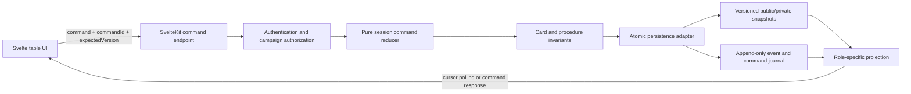

# Campaigns and Shared Tarot — Design Specification

**Status:** Proposed written specification incorporating the approved product design

**Date:** 2026-07-15

**Target:** Guild Book, SvelteKit monolith on SQLite/D1

## 1. Summary

Guild Book will add a campaign area where one GM can create and own a campaign, share a persistent join link, accept signed-in players immediately while the link is open, and maintain one in-world Guild Roster. Each player may attach one completed adventurer they own. An adventurer may be active in only one campaign globally, and a player may have no more than one active adventurer in a campaign.

The campaign's primary play surface is a server-authoritative shared tarot table. It implements every tarot operation required during an active session, with guided flows for the Challenge and Crawl phases and reusable procedures for the remaining in-session rules. The interface deliberately stops short of being a virtual tabletop: it manages cards, ownership, visibility, procedure state, and the small number of values needed to resolve tarot rules, but it does not model maps, positioning, wounds, inventory consumption, gold, or narrative consequences.

The 78 Rider–Waite–Smith card faces and two card backs in the repository's authorized 80-image source set will be processed into responsive production assets. Cards appear uncropped in an archival frame so the original border and artwork remain visible. A card identity that is private to a player is never included in the GM's or another player's server response, rendered HTML, DOM attributes, image URLs, accessible labels, logs, or error messages.

## 2. Goals

The first release must let a table:

1. Create, join, view, archive, and manage a campaign.
2. Maintain a separate in-world Guild Roster within that campaign.
3. Attach, replace, release, and mark adventurers dead under the agreed campaign rules.
4. Start and end one persistent play session at a time.
5. Share the correct major and minor tarot decks across all connected participants.
6. Run Challenges, exploration, tests, and every other in-session tarot procedure described by the imported Markdown rules.
7. Preserve private hands and face-down cards even from the GM.
8. Recover cleanly from refreshes, reconnects, duplicate submissions, stale clients, and transient network failures.
9. Retain an auditable public session history without exposing private card faces after the session.
10. Work with both local SQLite and production Cloudflare D1.

## 3. Non-goals

The first release does not include:

- GM preparation generators for cities, dungeons, the Underworld, denizen encounters, treasure, or adventure seeds.
- Maps, tokens, measured movement, spatial positioning, fog of war, voice/video, chat, or a general-purpose virtual tabletop.
- Automatic application of wounds, conditions, inventory changes, equipment damage, gold, or fictional consequences.
- Co-GMs, GM transfer, spectators outside the campaign, or multiple simultaneous GMs.
- Campaign deletion. Campaigns may be archived read-only.
- Real-time WebSockets, Cloudflare Durable Objects, or peer-to-peer state synchronization.
- End-to-end encryption against database operators. Privacy is an application authorization guarantee: the GM and other players cannot receive a player's private card identities.
- Destructive migration or repurposing of the existing unused `guilds`, `guildMembers`, and `guildDraws` tables.

The existing standalone `/deck` utility may reuse the upgraded card renderer and artwork, but it remains local utility state and is not an authoritative campaign session.

## 4. Terminology

- **Campaign:** The application container owned by one GM. It contains membership, invite settings, the Guild Roster, adventurer tenures, play sessions, and history.
- **Guild Roster:** The single in-world guild record inside a campaign: name, sigil description, terms, marching order, roles, contracts, deeds, Fame, and the active/historical adventurer roster.
- **Member:** A signed-in non-GM user who joined the campaign.
- **Adventurer tenure:** The interval during which one character is the member's active adventurer in a campaign.
- **Play session:** A GM-started, persistent period of shared tarot play. A campaign has at most one active play session.
- **Procedure:** A guided tarot interaction such as a test of fate, Crawl draw, Challenge round, or oracle draw.
- **Public state:** State visible to every current campaign participant.
- **Private state:** Card identities and other procedure values visible only to one authorized user.
- **Command:** A validated user intent applied by the server to the current session version.
- **Event:** An immutable audit record emitted by an accepted command or campaign lifecycle change.

## 5. Architectural shape

The campaign table uses a versioned snapshot plus an append-only command/event journal.



The browser never determines the authoritative shuffle, draw, rule result, or card destination. It sends intent. A pure engine function validates the command against reconstructed server state and returns the next state and events. The persistence adapter commits the expected-version guard, snapshot, private rows, events, idempotency record, and any coupled character mutation as one logical transaction.

This design provides cheap reads and straightforward recovery without relying on client determinism. The event journal is an audit and synchronization source, not the only way to reconstruct current state in the first release.

## 6. Domain and persistence model

All IDs are opaque generated IDs. All timestamps are stored in UTC. JSON columns have a schema version and are validated with Zod at every application boundary. Table and column names below are normative at the domain level; the implementation plan may adapt exact Drizzle syntax to existing repository conventions without changing their meaning.

### 6.1 Campaigns

`campaigns` stores:

- `id`
- `ownerUserId` — the sole GM and immutable owner in the first release
- `name`
- `description`
- `inviteTokenHash` — lookup/revocation hash; the raw token appears only in the share URL
- `inviteNonce`, `inviteVersion` — inputs for reproducing the current signed link for the authorized GM without storing the raw token
- `joinOpen`
- `archivedAt`
- `createdAt`, `updatedAt`

Only the owner can change campaign metadata, invite state, Guild Roster content, session lifecycle, or GM-only table controls. The owner is not a player membership and cannot attach an adventurer.

`guildRosters` has a one-to-one `campaignId` and stores a versioned document containing:

- Guild name and sigil description
- Terms
- Marching order
- Guild roles
- Contracts
- Deeds
- Fame

The GM edits this shared document; every current member can read it. Active and historical adventurer entries are derived from tenure records rather than duplicated as manually editable roster data.

### 6.2 Membership

`campaignMembers` stores:

- `id`, `campaignId`, `userId`
- `joinedAt`
- `leftAt`
- `removedAt`, `removedByUserId`

A partial unique index permits only one active membership for a user in a campaign. Rejoining after a voluntary departure creates a new membership record so prior tenure and audit history remain stable.

Membership and adventurer attachment are separate. A player can join with no adventurer, observe a live session, and attach an eligible adventurer later under the session rules below.

### 6.3 Adventurer tenures and death state

`campaignAdventurerTenures` stores:

- `id`, `campaignId`, `membershipId`, `characterId`
- `startedAt`, `startedByUserId`
- `endedAt`, `endedByUserId`
- `endReason`: `replaced`, `left`, `removed`, `died`, or `corrected`
- `deathSessionId` when death occurred during play

Two database constraints enforce the central ownership rules:

- At most one active tenure for a membership.
- At most one active tenure for a character across all campaigns.

An adventurer is eligible for attachment only when it:

- Is owned by the attaching user.
- Passes the existing completed/finalized character predicate.
- Is alive.
- Is not archived.
- Has no active campaign tenure.

The character document gains a versioned life record:

```ts
type CharacterLife =
  | { status: 'alive' }
  | {
      status: 'dead';
      diedAt: string;
      campaignId?: string;
      sessionId?: string;
      markedByUserId: string;
    };
```

A denormalized indexed `lifeStatus` column mirrors the JSON document for eligibility queries. Character JSON remains the canonical character record, and updates to both representations occur atomically.

The character owner may mark their own adventurer dead. A campaign GM may mark only an adventurer with an active tenure in that GM's campaign. Death globally marks the character dead, ends the current tenure, releases the player's campaign slot, and preserves the tenure in roster history.

An audited correction may reverse an erroneous death. If a replacement is already attached, the corrected character becomes alive but remains unattached; restoring its active tenure would violate the one-adventurer rule and therefore requires a later voluntary replacement when no session is active.

### 6.4 Play sessions and snapshots

`playSessions` stores:

- `id`, `campaignId`, monotonically increasing `sequence`
- `status`: `active`, `ended`, or `frozen`
- `phase` and active procedure identifier
- Content-pack ID, content-pack version, and procedure schema version pinned at start
- `version` for compare-and-set commands
- Versioned `publicStateJson`
- `startedAt`, `startedByUserId`, `endedAt`, `endedByUserId`
- `finalPublicStateJson` and `integrityDigest` after ending

A partial unique index allows only one active or frozen session per campaign. A frozen session still occupies the slot until recovered or ended.

`sessionPrivateStates` stores one validated private projection fragment per `(sessionId, recipientUserId)`. Player hands, private face-down identities, and the GM's hand are held here, not in public JSON. The server reconstructs full engine state from the public and private fragments only while applying a command.

### 6.5 Commands, events, and secrets

`sessionCommands` stores:

- `(sessionId, commandId)` as a unique idempotency key
- Actor, request hash, expected session version, optional expected character version
- Command type and non-secret audit metadata
- Original outcome status and resulting version
- A private response envelope used only to replay a duplicate request during an active session
- `createdAt`

Reusing a command ID with a different request hash is rejected. Reusing it with the same request returns the original outcome and does not apply the command again.

`campaignEvents` provides a monotonically increasing campaign cursor and stores campaign/session lifecycle and accepted-command events:

- `id`/cursor, `campaignId`, optional `sessionId`, optional `commandId`
- Actor, event kind, sanitized public payload, timestamp

`campaignEventSecrets` stores an optional payload for a single event and recipient. Private event payloads are returned only to that recipient. They are never copied into the public payload.

When a session ends, the server replaces mutable session state with the final public projection, removes all `sessionPrivateStates`, removes private event payloads and secret-bearing idempotency response fields, and records an integrity digest over the ordered public history and final public state. Publicly revealed and discarded card identities remain in history. Cards that never became public remain permanently redacted.

### 6.6 Atomicity on SQLite and D1

Local SQLite uses a database transaction. D1 uses a sequential `D1Database.batch()` guarded by a database-level version check that aborts the batch if the expected session version or optional character version is stale. The guard must fail the transaction, not merely update zero rows. A small guard table and `BEFORE INSERT` trigger using SQLite `RAISE(ABORT, ...)` is the expected implementation technique.

The guarded batch includes, as applicable:

1. The idempotency/guard insertion.
2. The versioned public snapshot update.
3. Private snapshot changes.
4. Public and private event inserts.
5. Character life and tenure changes.
6. The stored command outcome.

Any failure rolls back the complete mutation. The same reducer and persistence contract are tested against better-sqlite3 and local D1.

## 7. Campaign lifecycle

### 7.1 Creation and invitation

`/campaigns/new` creates the campaign and its separate Guild Roster in one transaction. The creator becomes the immutable GM owner. The invite is an unguessable, versioned token signed with a dedicated deployment secret. The database stores its lookup hash and rotation inputs, allowing the server to reproduce the current link only for the authorized GM without storing the raw token. Rotation changes the nonce/version and hash.

The GM can:

- Copy the persistent join link.
- Close or reopen joining without changing the link.
- Rotate the token, immediately invalidating the old link.

`/join/[token]` displays a minimal campaign preview. An unauthenticated visitor signs in and returns to the same invitation. A signed-in visitor confirms joining. If the campaign is open, membership is created immediately without GM approval. The action is idempotent and redirects an existing active member to the campaign. A closed, invalid, rotated, or archived invitation cannot create membership.

### 7.2 Attachment and replacement

Outside an active session, a member may replace their active living adventurer at any time. The existing tenure ends with `replaced`, making that living character eligible for another campaign, and the new tenure begins atomically.

During an active session:

- A newly joined player may observe but cannot make an initial attachment.
- A living adventurer cannot be voluntarily detached or replaced.
- If the member's active adventurer dies during that session, the member may attach a replacement immediately.
- Outside a Challenge, the replacement enters the session roster immediately.
- During a Challenge, the replacement appears as joining and receives a hand at the next legal deal or round boundary. It is never injected into a partially resolved turn.

This exception supports the rulebook's instruction to create a new adventurer and rejoin play as soon as possible after a death without allowing mid-session roster swapping.

### 7.3 Leaving, removal, and archival

A player may leave only when no session is active. Leaving ends any active living tenure with `left` and releases that character. Historical sessions and tenures remain in the audit record, but former members lose campaign and session-history access.

The GM may remove a member immediately for access safety. If a session is active, the server performs an audited cleanup command that returns the removed user's private cards to their owning draw pile and shuffles that pile, logging counts but no identities. It also resolves public cards through their normal configured cleanup destinations, ends the tenure with `removed`, and revokes sync access before returning success.

The GM may archive a campaign only when no session is active. An archived campaign and its completed histories are read-only. Current members and the GM can still view it; invitations and new sessions are disabled.

### 7.4 Session lifecycle

The GM explicitly starts and ends sessions.

Starting a session:

- Pins the content-pack and tarot-procedure versions.
- Builds fresh major and player decks from the configured card catalog.
- Places trumps I–XXI in the GM deck and the four minor suits plus the Fool in the player deck, as specified by the rules content.
- Uses a server-generated shuffle seed and stores only the information needed for authoritative recovery and auditing.
- Initializes distinct draw and discard zones.
- Adds every currently attached living adventurer to the session roster.

The session survives navigation, refresh, disconnect, process restart, and an overnight pause. The browser stores no authoritative deck state.

The shuffle seed and recoverable shuffled order remain server-private during play. Ending the session purges any value that could reconstruct an unrevealed card identity; only a one-way commitment may remain in the public integrity record.

Ending a session is an explicit GM command. It closes the active procedure safely, creates the final public projection and integrity digest, purges unrevealed secrets, and makes the completed session visible to the GM and every current campaign member. The history contains the public event timeline, revealed cards, discard history, procedure outcomes, corrections, and roster events; it never contains private faces that were not revealed during play.

## 8. Shared tarot engine

### 8.1 Pure engine boundary

New functions under `src/lib/engine/session/` are pure, stateless, and isolated from SvelteKit, UI, and database imports. They receive validated content-pack configuration, complete server-only engine state, actor capabilities, and a command. They return either a typed rejection or a next state plus typed public/private events.

The existing `tarot-deck.ts` and `tarot-resolution.ts` functions should be reused or refactored into shared primitives where their behavior matches the rulebook. Campaign code must not duplicate shuffle, value, suit, or test rules.

### 8.2 Card identity and zones

Each of the 78 tarot cards has one stable content-pack card ID. At every active-session version, each card exists in exactly one engine zone. Events may reference a card but never constitute a second live location.

Required zone categories are:

- Major draw and discard piles
- Player draw and discard piles
- A private GM hand
- One private player hand per participating adventurer
- Public initiative and played-card areas
- Private face-down or prepared areas with a public card-back projection
- Inspiration and other rule-defined held-card zones
- Procedure-owned pending and selection zones

Every zone declares its owning deck, visibility, ordering semantics, allowed card kinds, and legal transitions. The engine conserves the complete configured deck after every command. It rejects duplicate IDs, missing cards, cross-deck moves, illegal visibility changes, and ownership violations.

Public projections expose card counts, public cards, public pile tops, procedure status, and authorized controls. A player's projection adds only that player's private identities. The GM's projection adds only the GM hand and GM-private procedure identities. No projection code path grants the GM a player's secret values.

### 8.3 Command vocabulary

The engine exposes a small composable vocabulary:

- `draw`
- `deal`
- `play`
- `place-facedown`
- `reveal`
- `discard`
- `transfer`
- `select-from-discard`
- `reorder-top`
- `begin-procedure`
- `advance-procedure`
- `complete-procedure`
- `end-round`
- `apply-correction`

Procedure modules constrain these primitives by phase, actor, owner, count, source, destination, and rule configuration. Generic table controls use the same commands and therefore retain all authorization, visibility, conservation, and audit behavior.

### 8.4 Drawing and reshuffling

Draws are server-authoritative. If a requested draw exceeds the eligible draw pile, the engine automatically shuffles only the eligible discard pile and continues. Cards in hands, initiative, face-down play, inspiration, pending selections, and any other in-play zone are excluded.

The Fool's effect is contextual:

- During a Challenge, it completes at the end of the round.
- During another guided procedure, it completes at that procedure's rule-defined boundary.

The effect reshuffles the configured major and player draw/discard piles while leaving held and in-play cards untouched. The content pack specifies the trigger and affected zones so the UI does not hardcode it.

### 8.5 Tests and calculated values

Guided tests read the attached character's required attribute and current Resolve value from server-side character data. The engine calculates card value, suit interactions, favor/disfavor, group results, and the configured success comparison.

Pushing a test never spends Resolve implicitly. The player receives a confirmation showing the exact cost and resulting Resolve. Acceptance issues an atomic command carrying the expected character version; character Resolve and session events update together. Wounds and fictional consequences remain manual character-sheet/table decisions.

### 8.6 Challenge state machine

The guided Challenge procedure owns:

- Participant selection from the live session roster
- Initial and round dealing
- Private player and GM hands
- Initiative placement and reveal
- Active turn/phase markers
- Legal player and GM card plays
- Minor actions and interrupts as logged declarations
- Prepared and face-down cards
- Public played cards and discard destinations
- End-of-round cleanup
- Fool resolution
- Hand-size and deal-size modifiers read from characters and content
- Joining a replacement adventurer at a legal boundary after death
- Ending the Challenge and returning cards to configured zones

The GM advances phases and rounds. Players control only their own allowed hand and face-down commands. The application calculates card and hand totals where rules require them, but the GM records the fictional target and outcome. It does not model a battle map, range, movement, wounds, monster health, or status application.

Challenge exceptions with distinct card movement or privacy receive typed subprocedures or modifiers rather than free-text instructions. The initial coverage includes Counsel transfers, High Chant discard selection and inspiration, Guardian Angel, Aim, shield initiative replacement, Area Sense, leeches, Augury's private GM draw and later reveal, Maleficence, Malediction, and Random Totem. Denizen abilities that only use normal Challenge play/discard operations use the generic commands rather than bespoke automation.

### 8.7 Corrections

The GM receives scoped correction controls for mistaken card movement, premature phase advance, and procedure cleanup. A correction is a new compensating command and event; it never rewrites or deletes history. Corrections use server-selected opaque references where necessary so the GM can repair a player's hidden zone without learning card identities.

Corrections must still satisfy card conservation, ownership, deck boundaries, session membership, and privacy. A correction that cannot preserve invariants is rejected.

## 9. In-session procedure coverage

All draw counts, deck choices, value tables, Fool behavior, selection rules, and rule references live in a new validated `tarot-procedures.json` content-pack resource. Components render procedure definitions and engine outcomes; they do not encode game rules in conditionals.

| Rules area | First-release support | Interaction model |
|---|---|---|
| Session setup | Major/player split, fresh shuffle, separate discards, visible discard tops, Fool handling | Automatic session initialization and guided boundaries |
| Basics | Tests of fate, push, favor, disfavor, group tests, Fool | Guided test panel using character values and explicit Resolve confirmation |
| Crawl | Meatgrinder, room/watch/noise/careful-movement draws, darkness draws | Guided exploration panel plus reusable oracle draws |
| Crawl oracles | Disposition, random target, equipment, and other discard lookups | Draw/discard card, show configured lookup result, log public outcome |
| Challenge | Deal, private hands, initiative, turns, actions, interrupts, prepared cards, cleanup, mulligan, reshuffle | Full guided Challenge state machine |
| Challenge exceptions | Counsel, High Chant, Guardian Angel, Aim, shield initiative, Area Sense, leeches, Augury, Maleficence, Malediction, Random Totem | Typed modifiers/subprocedures sharing the core card commands |
| Camp | Meatgrinder/Patrol and the rule-defined draw-twice choice | Guided draw with choice and audit entry |
| City during play | City Events and Signs, Beg & Busk, Carouse, Job Board, Doomsaying, Strange Communions, Stargazing | Reusable guided draw, select, and reorder procedures |
| Sorcery and random tables | Tarot-driven spell and table lookups used at the live table | Configured oracle, hidden draw, reveal, select, and reorder controls |
| Unforeseen in-session use | Draw, deal, reveal, discard, transfer, select from discard, reorder top | Generic audited table controls with deck and privacy constraints |

Preparation-oriented tables in Gamemastering, City Creation, and Underworld Creation remain deferred even if they also use tarot. The boundary is the moment of use: a City draw performed during an active play session is supported; generating the city before play is not.

Every procedure definition includes a human-readable title, rule-source citation, deck, visibility, draw count or formula, lookup table if any, legal actors, result visibility, completion boundary, and recovery behavior. A content validator proves that referenced cards, character fields, tables, and artwork IDs exist.

## 10. API, synchronization, and projection

### 10.1 Routes

Primary pages are:

- `/campaigns` — campaigns the user owns or has joined
- `/campaigns/new` — GM campaign creation
- `/campaigns/[campaignId]` — campaign dashboard, Guild Roster, membership, attachment, invite settings, and session history
- `/campaigns/[campaignId]/table` — active shared tarot table
- `/campaigns/[campaignId]/sessions/[sessionId]` — completed public session history
- `/join/[token]` — invitation preview, authentication return, and join confirmation

Mutation endpoints remain narrow. The table centers on:

- `GET /api/campaigns/[campaignId]/sync?after=<cursor>&version=<version>`
- `POST /api/campaigns/[campaignId]/sessions/[sessionId]/commands`

Campaign, membership, tenure, invite, death, and session-lifecycle endpoints use the same service-layer authorization and event conventions. Page form actions may wrap these services where they improve progressive enhancement.

### 10.2 Command envelope

Every session command includes:

```ts
type SessionCommandEnvelope = {
  commandId: string;
  expectedSessionVersion: number;
  expectedCharacterVersion?: number;
  command: SessionCommand;
};
```

The server authenticates the user, validates the envelope with Zod, loads campaign capabilities and pinned content, reconstructs engine state, runs the pure reducer and invariants, persists atomically, and returns the actor's new projection plus cursor/version metadata.

### 10.3 Polling

While the table route is mounted, the client automatically performs approximately one sync request per second. A no-change response is `204` or an equivalently tiny cursor/version response. A changed response contains only events and projection fragments authorized for that requester.

Polling starts immediately on mount and after every command response, backs off on transient failures, and resumes immediately on focus or network recovery. It continues across a long-open session page. The client shows last-sync time and connection status.

The first release target is that an accepted command becomes visible to all connected participants within two seconds under the baseline load of one GM and eight players. There is no hard eight-player product cap.

### 10.4 Client behavior

The campaign session store contains only the current authorized projection, cursor, version, connection state, and pending command metadata. It does not persist private card faces to `localStorage` or reconstruct a deck.

Card-changing UI waits for authoritative acceptance. A network retry reuses the same command ID. A `409` stale-version response does not apply or automatically replay the intent; the client synchronizes, explains that the table changed, and asks the user to retry if the action is still relevant. While offline, the table is read-only and does not queue draws or card plays.

## 11. Authorization, privacy, and security

Every read and mutation passes through a centralized campaign capability service. Capabilities distinguish GM, active member, character owner, active-tenure owner, session participant, and history viewer. Client controls are conveniences; server checks are authoritative.

Key requirements are:

- The GM can see the GM major-card hand but not any player's private hand or private face-down values.
- A player can see only their own private identities.
- Everyone can see public plays, initiatives, revealed cards, configured discard tops, public results, and zone counts.
- Campaign sheets are visible to the GM and active members. Only the character owner can edit the sheet; the campaign GM receives only the scoped mark-dead action.
- A removed or departed member loses campaign sync and history authorization immediately.
- Hidden identities do not appear in SSR data, JSON not intended for the recipient, HTML, DOM attributes, image URLs, preload hints, alt text, analytics, structured logs, exception messages, or telemetry.
- A hidden card renders an authorized back asset with accessible text such as “Face-down tarot card,” never the concealed name.
- Invite tokens have high entropy, use a dedicated signing secret, are stored only as a hash plus non-secret rotation inputs, are redacted from logs, and are invalidated by rotation.
- Authenticated campaign/session responses and invitation responses send `Cache-Control: private, no-store`; Cloudflare caches must not store or share personalized projections.
- State-changing requests require the authenticated same-origin flow and SvelteKit/CSRF protections.
- User-authored campaign and roster text is length-limited, validated, and rendered as text rather than trusted HTML.
- Command and invitation endpoints receive conservative request throttling without weakening idempotent retries.

Projection tests treat any cross-role card identity leak as a release blocker.

## 12. Table-first interface

The active table uses the approved **Table First** layout:

- A compact phase/procedure rail on the left
- The shared tarot table as the dominant center surface
- A public event and procedure log on the right
- The current user's private hand anchored along the bottom

On narrow screens, the table remains primary. The phase rail and log collapse into drawers or tabs, and the private hand becomes a horizontally scrollable tray. Controls remain reachable by keyboard and touch. Motion respects reduced-motion preferences.

Major areas include:

- Session header with campaign, connection, participants, version-safe status, and GM start/end controls
- Public deck/discard stations showing backs, counts, and authorized top cards
- Procedure workspace for tests, Crawl, Challenge, and generic draws
- Public initiative/played/prepared areas
- Private hand tray rendered only from the current user's projection
- Phase rail with valid next steps and GM controls
- Chronological public log with actor, action, rule reference, and correction markers
- Roster/death notifications and replacement eligibility state

The table does not render a map, token canvas, combat tracker, health tracker, or fictional positioning system.

## 13. Tarot artwork and asset pipeline

The authorized source contains 78 Rider–Waite–Smith face scans and two card backs under `assets-src/tarot/rwsa/`. Source scans remain outside the production static tree and are not served directly.

A deterministic build script will:

1. Read an explicit source-to-card mapping rather than infer identity only from filenames.
2. Verify exactly one face image for every configured tarot card and exactly the configured back assets.
3. Preserve the entire scan and original printed border with no crop.
4. Normalize orientation and metadata without changing the artwork.
5. Generate responsive AVIF and WebP variants for hand/table/detail display.
6. Produce dimensions, hashes, variant paths, and credit/license metadata in a validated `tarot-art.json` manifest.
7. Fail when an image is missing, duplicated, unmapped, or unexpectedly changed.

The UI uses an **Archival Frame** treatment: the complete artwork sits inside a restrained frame, followed by a slim application label/value footer. The application frame does not imitate the HMTW rulebook's trade dress. Cards can open into a larger accessible detail view.

The art manifest records the source collection, artist attribution, acquisition/permission note, processing date, source hash, and public-facing credit. The licensing page and production credits identify the Rider–Waite–Smith artwork and the authorized scan source. The legal review assumption for this specification is that permission for this exact 80-image scan set has been obtained.

## 14. Error handling and recovery

The system uses explicit typed failure modes:

- **Duplicate command:** Return the original active-session outcome without applying it again.
- **Stale version:** Return `409`, current version/cursor metadata, and no mutation.
- **Invalid or unauthorized command:** Return a typed `4xx` rejection and no mutation.
- **Transient database/network failure:** Return a retryable response; the client retries only with the same command ID.
- **Offline client:** Preserve the last authorized projection, show it as stale/read-only, and resume synchronization when online.
- **Invariant failure before commit:** Reject the command and persist nothing.
- **Invalid stored snapshot:** Mark the session frozen, prevent further card commands, retain the last durable data, and provide the GM a safe end/export path while an operator repairs the issue.

The command service records structured non-secret diagnostics: campaign/session IDs, command type, actor ID, expected/current versions, outcome class, and timing. It never logs raw invite tokens, hidden card IDs, private payloads, character JSON, or stored response envelopes.

An end-session operation must be retryable and idempotent. Secret purging, final projection creation, and digest storage happen atomically so a session cannot appear completed while private rows remain exposed to application queries.

## 15. Module decomposition

Expected pure engine modules:

- `src/lib/engine/session/types.ts`
- `src/lib/engine/session/commands.ts`
- `src/lib/engine/session/reducer.ts`
- `src/lib/engine/session/invariants.ts`
- `src/lib/engine/session/projection-types.ts`
- `src/lib/engine/session/test-of-fate.ts`
- `src/lib/engine/session/challenge.ts`
- `src/lib/engine/session/procedures.ts`
- `src/lib/engine/session/corrections.ts`

Expected server modules under `src/lib/server/campaigns/`:

- Campaign authorization/capabilities
- Invite hashing and join flow
- Membership and adventurer tenure services
- Guild Roster service
- Session lifecycle and state repository
- Atomic SQLite/D1 adapter
- Command service
- Projection and sync service
- Death/replacement service
- Correction and recovery service

Expected component groups under `src/lib/components/campaigns/`:

- Campaign dashboard, invite management, and Guild Roster
- Session shell and phase rail
- Shared table and deck/discard stations
- Private hand
- Public log
- Guided test and procedure panels
- Challenge workspace
- Reusable archival `TarotCard`

Route files remain thin. They validate transport input, call services, and return typed projections. Rule content stays in content-pack JSON. Business transitions stay in the pure engine or server services. UI components do not import database code or encode rule tables.

## 16. Migration and rollout

The work lands behind an unlinked campaign feature gate. The existing navigation does not expose campaigns until the acceptance suite passes.

Recommended release increments are:

1. **Foundation:** Schema, character life migration, campaign membership, invite flow, Guild Roster, capability checks, and empty session lifecycle.
2. **Shared table core:** Artwork pipeline, content procedure schema, authoritative decks, projection privacy, polling, generic commands, tests of fate, and Crawl procedures.
3. **Challenge:** State machine, private hands, round flow, Challenge exceptions, Resolve confirmation, and death replacement boundary.
4. **Completion:** Camp/City/sorcery procedures, history and secret purge, corrections, recovery, archival, performance, and accessibility hardening.
5. **Enablement:** Clean/current database upgrade verification, Cloudflare build, full acceptance run, legal/art credit review, and navigation enablement.

Database migration strategy:

- Add new campaign-prefixed tables and indexes in a forward-only Drizzle migration.
- Add the denormalized character life column with an alive default and backfill.
- Upgrade character documents through the existing migrate-on-read system.
- Leave legacy unused guild tables untouched for a separate cleanup decision.
- Test both a clean database and an existing populated database on SQLite and local D1.

## 17. Verification strategy

### 17.1 Pure engine tests

Engine coverage remains at least 90 percent for new session modules. Tests include:

- Seeded deterministic shuffle and draw results
- Major/player deck composition
- Card conservation after long randomized legal command sequences
- Rejection of duplicate, missing, cross-deck, wrong-owner, and illegal-phase moves
- Reshuffle eligibility and Fool boundaries
- Tests, push, favor/disfavor, group results, and Resolve confirmation
- Challenge setup, every round transition, cleanup, replacement joins, and listed exceptions
- Every content-configured procedure definition
- Projection redaction by role
- Correction commands and invariants

### 17.2 Database and service tests

Service suites cover:

- Join links open/closed/rotated/authentication return/idempotency
- Membership and global character uniqueness under concurrent attachment
- Voluntary replacement restrictions and active-session death exception
- Owner/GM death authorization and correction behavior
- Session uniqueness and content version pinning
- Idempotent commands, stale versions, request-hash mismatch, and atomic rollback
- GM removal cleanup without secret disclosure
- End-session finalization and secret purging
- Archived and former-member authorization
- Equivalent behavior on better-sqlite3 and local D1

### 17.3 Privacy regression tests

For GM, player A, player B, unauthenticated user, removed member, and completed-history viewer, tests inspect:

- JSON response bodies
- SSR/page data and rendered HTML
- DOM attributes and accessible names
- Image and preload URLs
- Sync deltas and event logs
- Error messages and captured structured logs

The fixtures use recognizable canary card IDs. Any canary appearing outside its authorized projection fails the suite.

### 17.4 End-to-end and nonfunctional tests

Playwright runs separate browser contexts for a GM and multiple players through:

1. Campaign creation and link sharing.
2. Sign-in return, immediate join, and character attachment.
3. Session start and synchronized table load.
4. Exploration draw and test of fate.
5. Full Challenge round with private hands, initiative, play, correction, and Fool handling.
6. Player death, replacement attachment at a legal boundary, and continued play.
7. Refresh/disconnect/reconnect and duplicate/stale command handling.
8. Session end, history visibility, and proof that unrevealed faces are absent.

Accessibility checks cover keyboard operation, focus order, dialogs/drawers, card-back labels, contrast, touch target size, and reduced motion. Asset tests validate mapping completeness, dimensions, hashes, formats, credits, and absence of source PNGs from the production output.

Load verification uses one GM plus eight polling players. Under the baseline test environment, accepted commands should appear for all connected participants within two seconds, no-change polls should remain small, and command processing should not lose or duplicate cards.

## 18. Acceptance criteria

The feature is ready to expose when all of the following are true:

- A GM can create a campaign, manage one Guild Roster, share/close/reopen/rotate a join link, start/end sessions, view history, and archive the campaign.
- A signed-in player can join immediately while the link is open and may remain a member without an adventurer.
- The database prevents a player from having two active adventurers in one campaign and prevents an adventurer from being active in two campaigns.
- Only eligible owned completed adventurers can be attached.
- Living adventurers can be replaced only without an active session; a death during play opens the replacement path and preserves history.
- The player owner and scoped campaign GM can mark an attached adventurer dead, with an audited correction path.
- A session starts with fresh correctly split decks, survives restart/reconnect, and permits only one active session per campaign.
- Challenge, Crawl, tests, Camp, in-session City, sorcery, oracle, and generic table procedures cover all in-session tarot use found in the imported Markdown rules.
- The GM cannot obtain a player's private card face through any supported application response or rendering path.
- Resolve is never spent without explicit player confirmation, and non-card fictional state remains outside table automation.
- Every accepted command is idempotent, version-checked, invariant-safe, atomic, and auditable.
- Everyone currently in the campaign can view completed public session history, while unrevealed private faces have been purged.
- The approved Rider–Waite–Smith art renders uncropped in an archival frame with responsive formats and recorded credits.
- The feature passes engine, service, privacy, Playwright, accessibility, migration, Cloudflare build, and baseline polling tests before navigation is enabled.

## 19. Deferred extensions

The architecture leaves explicit seams for later GM preparation tools, co-GMs, GM ownership transfer, richer roster collaboration, long-term campaign exports, WebSocket/Durable Object transport, and additional content packs. None of those seams may weaken the first-release authorization, privacy, or card-conservation model.

## 20. Source references

Repository references used for this design:

- `AGENTS.md`
- `assets-src/HMTW_md/01 - Chapter 1 - The Basics.md`
- `assets-src/HMTW_md/02 - Chapter 2 - The Adventurer.md`
- `assets-src/HMTW_md/03 - Chapter 3 - The Guild.md`
- `assets-src/HMTW_md/04 - Chapter 4 - Kith and Kin.md`
- `assets-src/HMTW_md/05 - Chapter 5 - The Four Paths.md`
- `assets-src/HMTW_md/06 - Chapter 6 - The Crawl Phase.md`
- `assets-src/HMTW_md/07 - Chapter 7 - The Challenge Phase.md`
- `assets-src/HMTW_md/08 - Chapter 8 - The Camp Phase.md`
- `assets-src/HMTW_md/09 - Chapter 9 - The City Phase.md`
- `assets-src/HMTW_md/10 - Chapter 10 - The Worm Turns - Gamemastering.md`
- `assets-src/HMTW_md/11 - Appendix A - Sorcery.md`
- `assets-src/HMTW_md/12 - Appendix B - Alchemy.md`
- `assets-src/HMTW_md/13 - Appendix C - Dungeon Denizens.md`
- `assets-src/HMTW_md/14 - Appendix D - City Creation.md`
- `assets-src/HMTW_md/15 - Appendix E - Underworld Creation.md`
- `src/lib/engine/tarot-deck.ts`
- `src/lib/engine/tarot-resolution.ts`
- `src/lib/server/db/schema.ts`
- `src/lib/components/tarot/`
- `src/routes/deck/`
- `static/content-packs/hmtw/`

Cloudflare D1's documented `batch()` transaction behavior informs the guarded atomic adapter: <https://developers.cloudflare.com/d1/worker-api/d1-database/#batch>.
